<h2 align="center">
  <b><i>Perceive</i>, <i>Ground</i>, <i>Reason</i>, and <i>Act</i>: A Benchmark for General-purpose Visual Representation</b>
</h2>

<div align="center" margin-bottom="6em">
Jiangyong Huang<sup>✶</sup>, William Yicheng Zhu<sup>✶</sup>, Baoxiong Jia, Zan Wang, Xiaojian Ma, Qing Li, Siyuan Huang
</div>
&nbsp;

<div align="center">
      <a href="https://arxiv.org/abs/2211.15402" target="_blank">
        </a>
      <a href="https://sites.google.com/view/g-vue" target="_blank">
        </a>
      <a href="https://eval.ai/web/challenges/challenge-page/1791/overview" target="_blank">
        </a>
      <a href="https://pytorch.org" target="_blank">
        </a>
</div>
&nbsp;

- [Overview](#overview)
- [Tasks](#tasks)
- [Datasets](#datasets)
- [Models](#visual-representations)

## Overview
#### Benchmark
We propose <b><ins>G</ins>eneral-purpose <ins>V</ins>isual <ins>U</ins>nderstanding <ins>E</ins>valuation (G-VUE)</b>, a comprehensive benchmark covering the full spectrum of visual cognitive abilities over four functional domains — *Perceive*, *Ground*, *Reason*, and *Act*.
<div align="center">
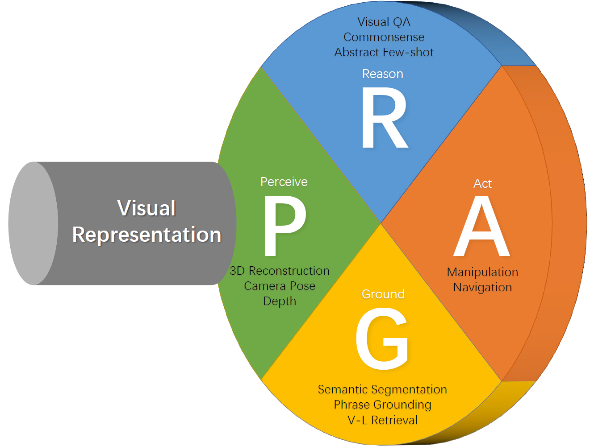
</div>

- *Perceive* characterizes the basic ability of understanding geometry from raw visual input.
- *Ground* examines the acquisition of visual semantics.
- *Reason* probes abstraction, logical deduction and commonsense reasoning.
- *Act* investigates the capability for planning and decision-making by learning policies.

The four domains are embodied in 11 meticulously chosen tasks, spanning from 3D reconstruction to visual reasoning and navigation.

#### Framework
Along with the benchmark, we also introduce **a general encoder-decoder framework** that that supports the evaluation of arbitrary visual representation on all 11 tasks.
<div align="center">
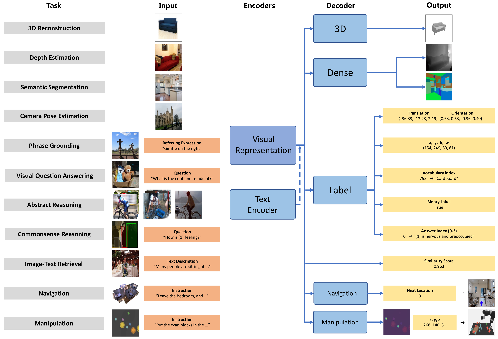
</div>

#### Implementation
We curate and organize a suite of modules for the training and evaluation of the 11 tasks, including configs, dataloaders, decoders, losses, metrics, and visualization tools.

## Tasks

| Task | Dataset | #Train/#Val/#Test | Text | Output | Metrics |
| :--- | :---: | :---: | :---: | :---: | :---: |
| ***Perceive*** |  |  |  |  |  |
| Depth Estimation | NYUv2 | 24k/-/0.6k | N | Depth Map | d<1.25, AbsRel, RMSE |
| Camera Pose Estimation | CL & 7-Scenes | (3.8k,26k)/-/(1.1k,17k) | N | Camera Pose | Mean Trans. & Orient. Error |
| 3D Reconstruction | ShapeNetCore | 30k/-/7.8k | N | Volumetric SDF | 3D IoU |
| ***Ground*** |  |  |  |  |  |
| Image-Text Retrieval | Flickr30k | 29k/1.0k/1.0k | Y | Matching Score | Recall@1,5,10 |
| Phrase Grounding | RefCOCO | 42k/3.8k/(2.0k,1.8k) | Y | Bbox | Acc@0.5 |
| Semantic Segmentation | ADE20K | 20k/2.0k/- | N | Segmentation Map | mIoU |
| ***Reason*** |  |  |  |  |  |
| Question Answering | GQA | 943k/132k/12.5k | Y | Choice | Accuracy |
| Commonsense Reasoning | VCR | 213k/26.5k/- | Y | Choice | Accuracy |
| Abstract Reasoning | Bongard-HOI | 23k/17k/14k | N | Binary Label | Accuracy |
| ***Act*** |  |  |  |  |  |
| Navigation | R2R | 14k/(1.0k,2.3k)/4.2k | Y | Next Move | SPL |
| Manipulation | Ravens | 0.8k/0.08k/0.8k | Y | Pick & Place | Success Score |

**Category 1: *Perceive*** 

* **Task 1.1:** Depth Estimation
  * NYUv2
  * `image` → `dense map [H,W]`
  * 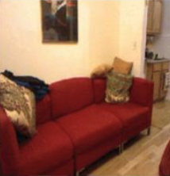 → 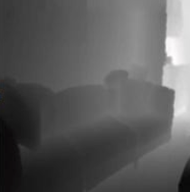
* **Task 1.2:** Camera Pose Estimation 
  * Cambridge Landmark & 7-Scenes
  * `image` → `translation and orientation [7]`
  *  → 
* **Task 1.3:** 3D Reconstruction
  * ShapeNetCore
  * `image` → `volumetric SDF [D,H,W]`
  * 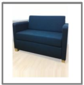 → 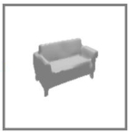

**Category 2: *Ground*** 

* **Task 2.1:** Image-Text Retrieval
  * Flickr30k
  * `image + text` → `similarity score [1]`
  * 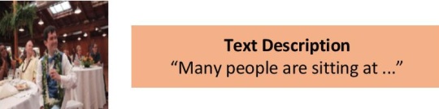 → 
* **Task 2.2:** Phrase Grounding
  * RefCOCO
  * `image + text` → `bbox [4]`
  * 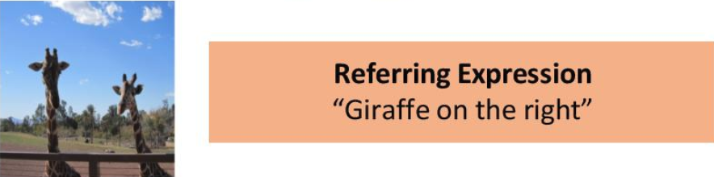 → 
* **Task 2.3:** Semantic Segmentation
  * ADE20K
  * `image` → `dense map [H,W]`
  *  → 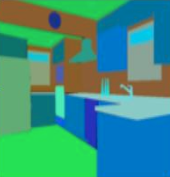

**Category 3: *Reason*** 

* **Task 3.1:** Visual Question Answering 
  * GQA
  * `image + text` → `vocab logits [1843]`
  * 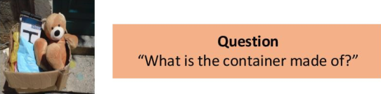 → 
* **Task 3.2:** Commonsense Reasoning 
  * VCR
  * `image + text` → `answer logits [4]`
  * 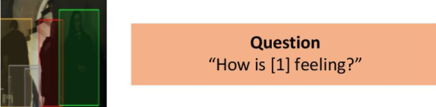 → 
* **Task 3.3:** Abstract and Few-shot Reasoning
  * Bongard-HOI
  * `images` → `class logits [2]`
  *  → 

**Category 4: *Act*** 

* **Task 4.1:** Navigation 
  * Room to Room
  * `image + text` → `direction label`
  * 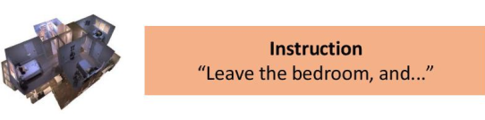 → 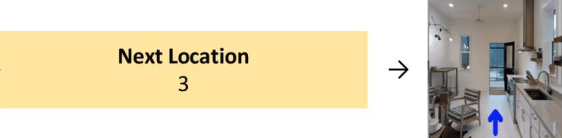
  * Index of the neighboring viewpoint for next movement
* **Task 4.2:** Manipulation 
  * CLIPort
  * `image + text` → `action position and rotation`
  * 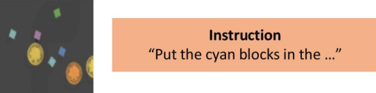 → 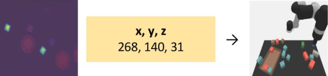
  * Where and how to manipulate inferred from dense affordance prediction


## Datasets
- Depth estimation. Due to the limited data in [NYUv2 official link](https://cs.nyu.edu/~silberman/datasets/nyu_depth_v2.html), we follow [BTS](https://github.com/cleinc/bts) to obtain a larger dataset for this task.
- Camera pose estimation. Download [Cambridge Landmarks](https://www.repository.cam.ac.uk/handle/1810/251342) and [7-Scenes](https://www.microsoft.com/en-us/research/project/rgb-d-dataset-7-scenes).
- Single-view 3D reconstruction. Download [ShapeNetCore](https://shapenet.org).
- Image-text retrieval. Download [Flickr30k](https://shannon.cs.illinois.edu/DenotationGraph).
- Phrase grounding. Download [RefCOCO](https://github.com/lichengunc/refer).
- Semantic segmentation. We adopt the data version in [MIT Scene Parsing Benchmark](http://sceneparsing.csail.mit.edu) instead of [ADE20K original data](https://groups.csail.mit.edu/vision/datasets/ADE20K). Download the former.
- Visual question answering. Download [GQA](https://cs.stanford.edu/people/dorarad/gqa).
- Commonsense reasoning. Download [VCR](https://visualcommonsense.com).
- Abstract and Few-shot Reasoning. Download [Bongard-HOI](https://zenodo.org/record/7079175#.ZDUtL-ZBw7c).
- Navigation.
- Manipulation.

## Visual Representations
| Representation | Architecture | Pre-training mechanism | Data |
| :---: | :---: | :---: | :---: |
| RN-IN | ResNet-50 | Supervised classification | ImageNet |
| RN-MoCo | ResNet-50 | Self-supervised Contrastive Learning | ImageNet |
| RN-CLIP | ResNet-50 | Vision-language Contrastive Learning | WebImageText |
| RN-Ego | ResNet-50 | Vision-language Contrastive Learning | Ego4D |
| ViT-32-CLIP | ViT-B/32 | Vision-language Contrastive Learning | WebImageText |
| ViT-16-CLIP | ViT-B/16 | Vision-language Contrastive Learning | WebImageText |
| ViT-16-MAE | ViT-B/16 | Self-supervised Masked Image Modeling | ImageNet |

In addition to the above prevalent visual representations as evaluated in the original paper, we add support for three newer models: GLIP, OFA and Unified-IO. We extract the visual backbone Swin-Tiny of GLIP to evaluate on adaptation, while directly use OFA-Huge and Unified-IO-XL to make inference on G-VUE. Details can be found in our paper.


## Setup

For setup instructions, please see the `setup/` directory.


## Repo Organization

`run/`

* Directory contains bash scripts for training each task.


`base_scripts/`

* Directory contains train.py, local_eval.py and other base train/eval python scripts.


`SUBMIT.py`

* Generate submission files to be submitted to online benchmark and evaluated.


`models/`

* Directory contains the encoder-decoder model implementation.


`datasets/`

* Directory contains task dataset implementations. For Navigation, dataset/environment is located in the `models\` directory.


`configs/`

* Directory contains hydra config files used in configuring the entire repo, including models, datasets, and training.


`setup/`

* (Work-in-progress, currently refactoring and moving stuff here). Directory contains setup scripts and related code.


`transforms/`

* Utils for `datasets/`. Implementations of dataset-specific image, text, and label transforms.


`utils/`

* General utils.


## BibTex
```
@article{huang2022perceive,
  title={Perceive, Ground, Reason, and Act: A Benchmark for General-purpose Visual Representation},
  author={Huang, Jiangyong and Zhu, William Yicheng and Jia, Baoxiong and Wang, Zan and Ma, Xiaojian and Li, Qing and Huang, Siyuan},
  journal={arXiv preprint arXiv:2211.15402},
  year={2022}
}
```
