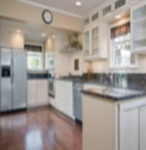
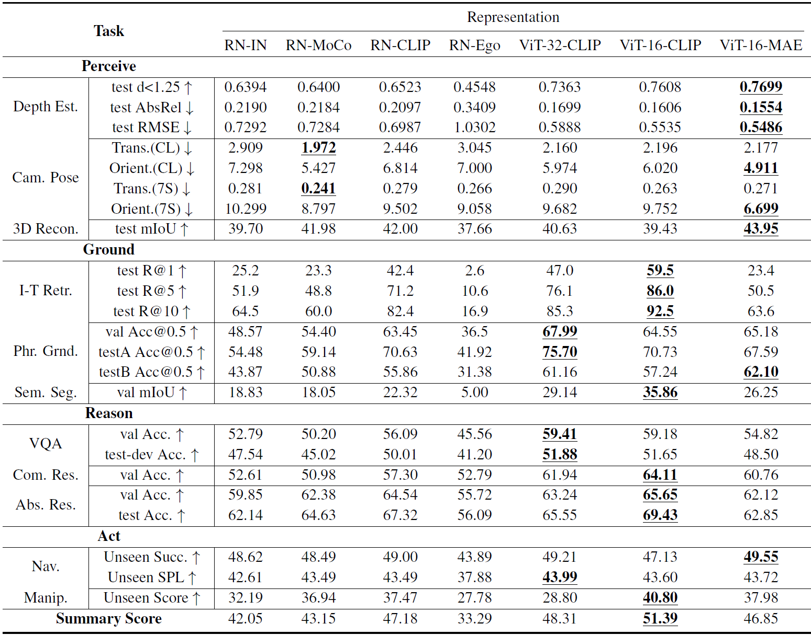

<h2 align="center">
  <b>G-VUE: General-purpose Visual Understanding Evaluation</b> 
</h2>

      
      
      

## Overview
#### Benchmark
We propose General-purpose Visual Understanding Evaluation (G-VUE), a comprehensive benchmark covering the full spectrum of visual cognitive abilities with four disjoint functional domains — *Perceive*, *Ground*, *Reason*, and *Act*.

- *Perceive* characterizes the basic ability of understanding geometry from raw visual input.
- *Ground* examines the acquisition of visual semantics.
- *Reason* probes abstraction, logical deduction and commonsense reasoning.
- *Act* investigates the capability for planning and decision-making by learning policies.

The four domains are embodied in 11 carefully curated tasks, spanning from 3D reconstruction to visual reasoning and navigation.

#### Framework
Along with the benchmark, we also provide a general encoder-decoder framework, which disentangles visual representation and accommodates arbitrary visual representation for holistic evaluation on all the 11 tasks.

## Tasks

| Task | Dataset | #Train / #Val/ #Test | Text | Output | Metrics |
| :--- | :---: | :---: | :---: | :---: | :---: |
| **Perceive** |  |  |  |  |  |
| Depth Estimation | NYUv2 | 24k/-/0.6k | N | Depth Map | d<1.25, AbsRel, RMSE |
| Camera Pose Estimation | CL & 7-Scenes | (3.8k,26k)/-/(1.1k,17k) | N | Camera Pose | Mean Trans. & Orient. Error |
| 3D Reconstruction | ShapeNetCore | 30k/-/7.8k | N | Volumetric SDF | 3D IoU |
| **Ground** |  |  |  |  |  |
| Image-Text Retrieval | Flickr30k | 29k/1.0k/1.0k | Y | Matching Score | Recall@1,5,10 |
| Phrase Grounding | RefCOCO | 42k/3.8k/(2.0k,1.8k) | Y | Bbox | Acc@0.5 |
| Semantic Segmentation | ADE20k | 20k/2.0k/- | N | Segmentation Map | mIoU |
| **Reason** |  |  |  |  |  |
| Question Answering | GQA | 943k/132k/12.5k | Y | Choice | Accuracy |
| Commonsense Reasoning | VCR | 213k/26.5k/- | Y | Choice | Accuracy |
| Abstract Reasoning | Bongard-HOI | 23k/17k/14k | N | Binary Label | Accuracy |
| **Act** |  |  |  |  |  |
| Navigation | R2R | 14k/(1.0k,2.3k)/4.2k | Y | Next Move | SPL |
| Manipulation | Ravens | 0.8k/0.08k/0.8k | Y | Pick & Place | Success Score |

**Category 1: Perceive** 

* **Task 1.1:** Depth Estimation
  * NYUv2
  * `image` → `dense map [H,W]`
  *  → 
* **Task 1.2:** Camera Pose Estimation 
  * Cambridge Landmark & 7-Scenes
  * `image` → `translation and orientation [7]`
  *  → 
* **Task 1.3:** 3D Reconstruction
  * ShapeNetCore
  * `image` → `volumetric SDF [D,H,W]`
  *  → 

**Category 2: Ground** 

* **Task 2.1:** Image-Text Retrieval
  * Flickr30k
  * `image + text` → `similarity score [1]`
  *  → 
* **Task 2.2:** Phrase Grounding
  * RefCOCO
  * `image + text` → `bbox [4]`
  *  → 
* **Task 2.3:** Semantic Segmentation
  * ADE20K
  * `image` → `dense map [H,W]`
  *  → 

**Category 3: Reason** 

* **Task 3.1:** Visual Question Answering 
  * GQA
  * `image + text` → `vocab logits [1843]`
  *  → 
* **Task 3.2:** Commonsense Reasoning 
  * VCR
  * `image + text` → `answer logits [4]`
  *  → 
* **Task 3.3:** Abstract and Few-shot Reasoning
  * Bongard-HOI
  * `images` → `class logits [2]`
  *  → 

**Category 4: Act** 

* **Task 4.1:** Navigation 
  * Room to Room
  * `image + text` → `class label (direction)`
  *  → 
  * index of the next neighboring viewpoint to move to, out of all neighbors
* **Task 4.2:** Manipulation 
  * CLIPort
  * `image + text` → `pick and place (action)`
  *  → 
  * where and how to manipulate, as determined by dense affordance prediction

## Visual Representations
| Representation | Architecture | Pre-training mechanism | Data |
| :---: | :---: | :---: | :---: |
| RN-IN | ResNet-50 | Supervised classification | ImageNet |
| RN-MoCo | ResNet-50 | Self-supervised Contrastive Learning | ImageNet |
| RN-CLIP | ResNet-50 | Vision-language Contrastive Learning | WebImageText |
| RN-Ego | ResNet-50 | Vision-language Contrastive Learning | Ego4D |
| ViT-32-CLIP | ViT-B/32 | Vision-language Contrastive Learning | WebImageText |
| ViT-16-CLIP | ViT-B/16 | Vision-language Contrastive Learning | WebImageText |
| ViT-16-MAE | ViT-B/16 | Self-supervised Masked Image Modeling | ImageNet |

In addition to the above representative visual representations, we evaluate three latest models: GLIP, OFA and Unified-IO. We extract the visual backbone Swin-Tiny of GLIP to evaluate on adaptation, while directly use OFA-Huge and Unified-IO-XL to make inference on G-VUE. Details can be found in our paper.

## Experimental Results

## Setup

For setup instructions, please see the `setup/` directory.

## Repo Organization

`run/`

* Directory contains bash scripts for training each task.

`base_scripts/`

* Directory contains train.py, local_eval.py and other base train/eval python scripts.

`SUBMIT.py`

* Generate submission files to be submitted to online benchmark and evaluated.

`models/`

* Directory contains the encoder-decoder model implementation.

`datasets/`

* Directory contains task dataset implementations. For Navigation, dataset/environment is located in the `models\` directory.

`configs/`

* Directory contains hydra config files used in configuring the entire repo, including models, datasets, and training.

`setup/`

* (Work-in-progress, currently refactoring and moving stuff here). Directory contains setup scripts and related code.

`transforms/`

* Utils for `datasets/`. Implementations of dataset-specific image, text, and label transforms.

`utils/`

* General utils.

